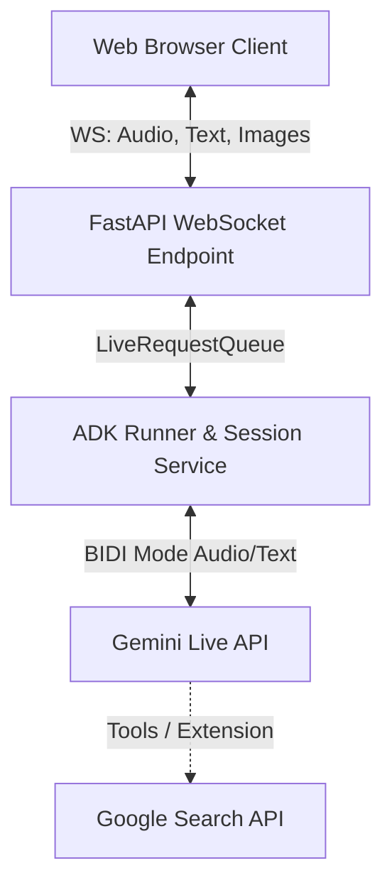
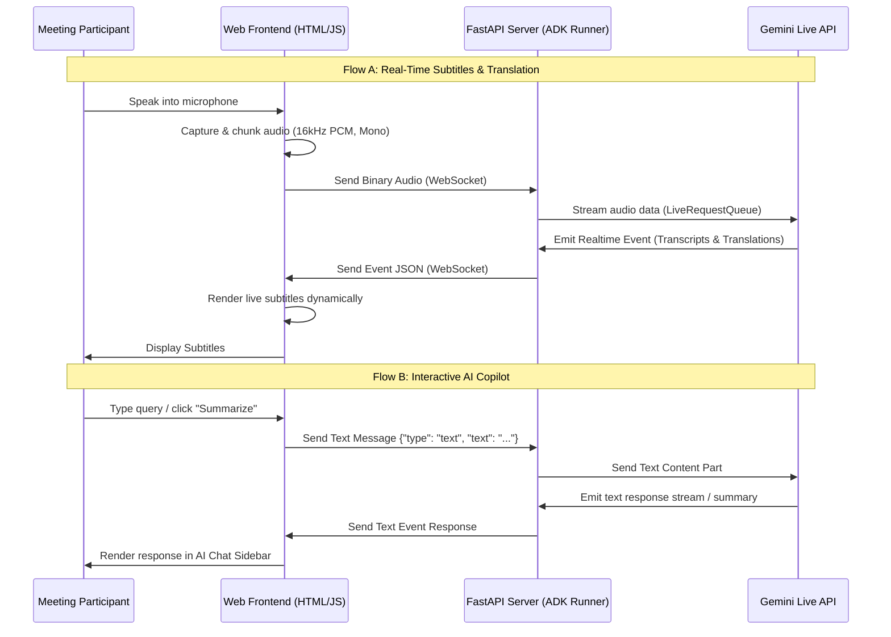

# Live Translation AI (Live Meeting Secretary) - System Design & Requirements

This document outlines the product requirements, system architecture, and UI/UX design specifications for the Live Translation AI system (Live Meeting Secretary), formulated by the Senior Project Manager based on the user stories in [user_story.md].

---

## 1. Executive Summary

In globalized business, multilingual meetings are increasingly common, but language barriers remain a significant friction point. Existing sequential translation solutions disrupt flow, while simple automated captions lack context and the ability to query meeting contents interactively.

The **Live Translation AI** is a real-time, low-latency meeting secretary app. By utilizing bidirectional streaming technology (FastAPI, WebSockets, and Google ADK), it delivers:

1. **Real-time spoken audio translation** directly to subtitles in a user's preferred language.
2. **An interactive on-the-fly AI Copilot** that users can query for summaries, clarifications, and action items during the meeting.

---

## 2. Product Requirements Document (PRD)

### 2.1 User Personas & Use Cases

* **Persona A (Multilingual Executive):** Needs to participate in a strategy meeting conducted in a language they do not speak fluently. They rely on real-time translated subtitles to follow along and use the AI to quickly explain specialized industry terms.
* **Persona B (Project Manager / Meeting Secretary):** Leads multilingual standups. They use the AI Copilot to generate real-time summaries and action items on the fly, saving hours of post-meeting wrap-up work.

### 2.2 Functional Requirements (FR)

| ID | Feature | Description | Priority |
| :--- | :--- | :--- | :--- |
| **FR-1** | Real-time Audio Capture | The frontend must capture local microphone audio, convert it to 16kHz PCM (16-bit, Mono), and stream it continuously via WebSockets. | P0 |
| **FR-2** | Real-time Translation | Spoken audio streams must be translated to the user's chosen preferred language in real time with high accuracy. | P0 |
| **FR-3** | Live Subtitle Overlay | Translated text must render dynamically in a clean, readable subtitle panel with smooth transition animations. | P0 |
| **FR-4** | Interactive AI Copilot | An on-the-fly chat sidebar allowing users to type queries (e.g., "What did we just agree on regarding the budget?") and receive summaries/replies instantly from the AI. | P1 |
| **FR-5** | EN/JA Bilingual Translation | Deep integration for English (EN) and Japanese (JA) speech translation. The system must support translating EN -> JA, JA -> EN, and auto-detecting the speaker's language. | P0 |
| **FR-5.1**| Bilingual Subtitle Layout | Option to display both the transcribed source text (original language) and the translated target text simultaneously in a stacked layout. | P1 |
| **FR-5.2**| Language Selection Dropdowns | Distinct UI selectors to choose the input/spoken language (English, Japanese, Auto-detect) and target translation language (English, Japanese). | P0 |
| **FR-6** | Visual Context Sharing | Ability to send camera captures or screen snippets to Gemini Live to provide visual context (e.g., slides, charts) for translation and query resolution. | P2 |
| **FR-7** | Meeting Export | Export option to save the transcript history and generated AI summaries. | P1 |

### 2.3 Non-Functional Requirements (NFR)

| ID | Attribute | Target Metric / Requirement | Priority |
| :--- | :--- | :--- | :--- |
| **NFR-1** | Latency | End-to-end latency from speaker utterance to subtitle display must be **< 1.0s** (target < 600ms). | P0 |
| **NFR-2** | Accuracy | High translation accuracy leveraging Gemini's native audio understanding. | P0 |
| **NFR-3** | UI/UX Quality | Sleek, professional dark-mode dashboard styled with responsive layouts, glassmorphic panels, and clear status indicators. | P0 |
| **NFR-4** | Connection Resilience | Auto-reconnect WebSockets on dropouts, maintaining session context up to 2 minutes of disruption. | P1 |
| **NFR-5** | Accessibility | High-contrast text, customizable subtitle size, and keyboard navigation support. | P1 |
| **NFR-6** | Security | Secure WebSocket (`wss://`) and HTTPS data transmissions to protect proprietary business meetings. | P0 |

---

## 3. System Architecture & Data Flow

### 3.1 Logical Architecture

The system consists of a web frontend (HTML/CSS/JS) connected to a FastAPI backend over a persistent WebSocket connection. The backend uses the Google Agent Development Kit (ADK) Runner to establish a bidirectional stream with Gemini Live API.

### 3.2 Sequence Diagram: Speech-to-Translation & AI Copilot Q&A

This diagram illustrates the lifecycle of audio streaming and concurrent text-based AI queries.

---

## 4. UI/UX Design Specifications

### 4.1 Layout Sections

The application will use a structured dashboard layout designed for maximum utility during active meetings:

1. **Header:**
    * Application Title: "Live Translation AI (Meeting Secretary)".
    * Connection status indicator (vibrant colored indicator: green for connected, amber for connecting, red for disconnected).
    * Language Configurator Dropdowns:
        * "Translate From": [Auto-Detect / English / Japanese]
        * "Translate To": [English / Japanese]
    * Layout Toggle: [Bilingual Mode (Both EN & JA) / Single Language Subtitles]
2. **Subtitle Viewport (Center-Left):**
    * Large, glassmorphic card displaying live translation captions.
    * Subtitle text should be large (24px-32px), high-contrast, with smooth fade-in animations as words are received.
    * For Bilingual Mode, display original text in a smaller, dimmer secondary line stacked with the primary translated text (e.g., Japanese original in 20px slate gray above/below English translated in 28px bright white).
3. **Interactive Copilot Sidebar (Right):**
    * A scrollable chat interface showing questions asked to the AI and its corresponding responses.
    * Preset quick-action buttons: "Summarize Last 5 Mins", "List Action Items", "Explain Terms".
    * Text input field at the bottom to type custom questions.
4. **Control Panel / Footer (Bottom):**
    * Mute/Unmute toggle button.
    * Start/Stop Translation stream toggle.
    * 📷 Camera Context toggle (to send screen/slide captures).
    * "Export Meeting Minutes" button.

### 4.2 Aesthetics & Styling Guidelines

* **Color Palette:** Deep space obsidian backgrounds (`#0a0b10`), charcoal workspace panels (`#161822`), neon violet/cyan accents (`#8a2be2`, `#00f2fe`) for highlighting interactive states and indicators.
* **Typography:** Google Fonts Outfit or Inter for crisp readability.
* **Micro-Animations:** Pulsing glow effect on the active microphone button; smooth slide-up animation for new chat bubbles; faded text transitions for subtitles.
